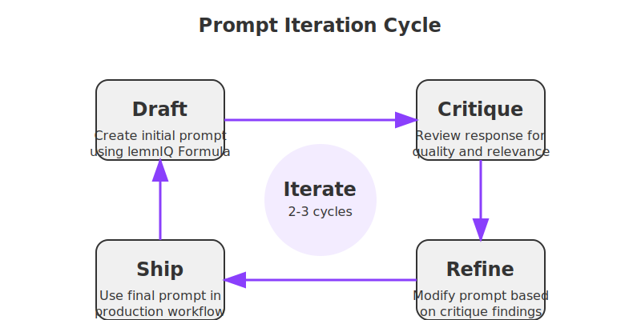

# Prompt Fundamentals

This section covers the essential concepts and techniques for crafting effective ChatGPT prompts. Understanding these fundamentals will give you a solid foundation for consistent, high-quality results.

## The lemnIQ Formula

```
ROLE + TASK + CONTEXT + STYLE + CONSTRAINTS (+ EXAMPLES)
```

The lemnIQ Formula provides a structured approach to prompt engineering:

* **ROLE:** "You are an empathetic copywriter …"
* **TASK:** "… draft a 2‑paragraph intro …"
* **CONTEXT:** "… for our monthly SaaS newsletter about churn …"
* **STYLE:** "… witty, no buzzwords …"
* **CONSTRAINTS:** "… ≤120 words, include ✨ emoji."
* **EXAMPLES (optional):** Paste a paragraph you love and say "Match this tone."

This formula helps ensure you provide all the necessary information for ChatGPT to generate the response you need.

## When to Ask Follow‑Up Questions

If ChatGPT might need information you haven't provided (e.g., audience pain points), tell it to ask first:

```prompt
Before answering, ask me any clarifying questions you need.
```

This approach creates a more interactive experience and often yields better results by ensuring ChatGPT has all the context it needs.

## Temperature & Top‑p Crash Course

* **Temperature 0.2 – 0.4:** Factual, deterministic responses with high consistency
* **Temperature 0.6 – 0.8:** Creative, varied responses with more novel ideas

*Tip:* Set **max_tokens** and **stop** parameters if you need disciplined length.

### Temperature Examples

**Prompt (Temperature 0.2):**
```
Summarize the core benefit of CRM software in one sentence.
```

**Output:**
CRM software centralizes customer data so teams can track and manage relationships efficiently.

**Prompt (Temperature 0.8):**
```
Describe the future of CRM tools in a playful tone.
```

**Output:**
Imagine a dashboard that practically winks at you while juggling chatbots, predictive analytics, and friendly nudges so no lead slips away.

## Prompt Iteration Cycle



The Prompt Iteration Cycle is a systematic approach to refining your prompts for optimal results:

1. **Draft**: Create your initial prompt using the lemnIQ Formula, focusing on clearly defining the role, task, and context.

2. **Critique**: Evaluate the response you receive, looking for:
   - Does it match your intended purpose?
   - Is it accurate and comprehensive?
   - Does it follow the specified constraints?
   - Are there any gaps or misunderstandings?

3. **Refine**: Based on your critique, revise your prompt by:
   - Clarifying ambiguous instructions
   - Adding missing context or constraints
   - Adjusting the role or style as needed
   - Possibly including examples to guide the tone

4. **Ship**: Once you've iterated 2-3 times and are satisfied with the results, integrate the polished prompt into your workflow.

This iterative approach turns a rough prompt into a reliable, reusable template in just a few passes. Most high-quality prompts require at least one or two refinement cycles to reach their full potential.

### Iteration Example

**Initial Prompt:**
```
Write a product description for our new fitness tracker.
```

**Refined Prompt:**
```
You are a copywriter specializing in health tech products. Write a 150-word product description for our new fitness tracker called "PulseTrack Pro" that highlights its 10-day battery life, sleep analysis features, and integration with nutrition apps. The tone should be energetic and motivational, appealing to fitness enthusiasts aged 25-40 who are goal-oriented. Emphasize how the product helps users improve their habits through data insights.
```

The refined prompt follows the lemnIQ Formula and provides specific details that result in a much more targeted, effective description.

## Next Steps

Once you've mastered these fundamentals, proceed to the [Advanced Techniques](../advanced-techniques/) section to learn more sophisticated prompting methods for complex use cases. 